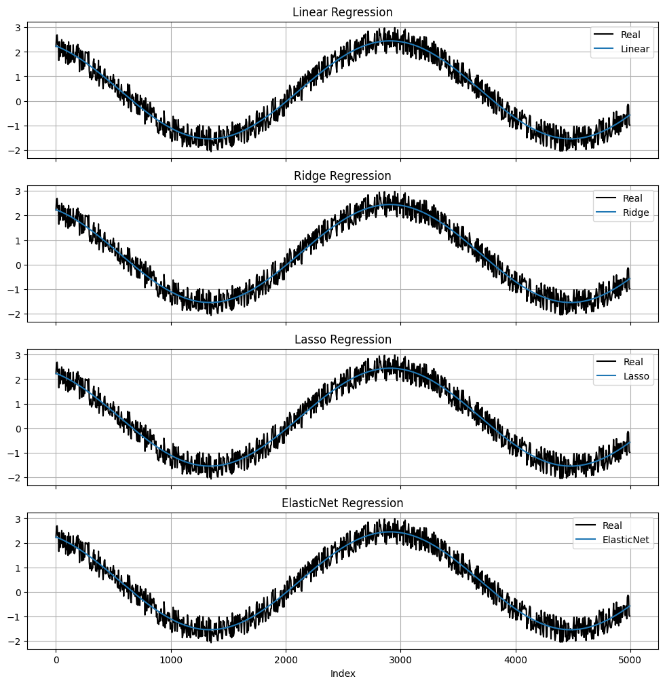

## رگرسیون خطی بر روی موج سینوسی با استفاده از داده ‌های مصنوعی

### معرفی پروژه
در این پروژه، هدف مدل‌سازی و برازش یک موج سینوسی نویزی است. داده‌ها به‌صورت مصنوعی و با استفاده از توابع ریاضی تولید شده‌اند. سپس با استفاده از مدل‌های مختلف رگرسیون (خطی، Ridge، Lasso و ElasticNet)، تلاش شده تا منحنی اصلی (بدون نویز) تخمین زده شود. تمامی مراحل فقط با استفاده از کتابخانه‌هایی انجام شده که استاد دوره معرفی کرده‌اند، و سعی شده از کدهای ساده، قابل فهم و پایه‌ای استفاده شود.

---

##  پیش ‌نیاز ها

برای اجرای این پروژه نیاز به نصب پکیج‌ های زیر دارید که در فایل `requirements.txt` نیز آمده است:

```
numpy~=2.3.1
matplotlib~=3.10.3
scikit-learn~=1.7.1
tabulate~=0.9.0
```

نصب با دستور:
```bash
pip install -r requirements.txt
```


### مراحل انجام پروژه:

#### 1. تولید داده‌های مصنوعی
در این پروژه، ابتدا داده ‌های مصنوعی با استفاده از تابع arange از کتابخانه numpy تولید می کنیم. که شامل ۵۰۰ هزار نقطه است. سیگنال اصلی به ‌صورت ترکیب دو موج سینوسی تعریف شده و سپس با افزودن نویز یکنواخت در بازه منفی ۰.۱ تا 1، یک موج نویزی ایجاد می کنیم .).

#### 2. افزودن ویژگی 
یکی از کارهایی که میشه انجام داد تا مدل بر روی موج سینوسی بتواند به خوبی آموزش ببیند این است که ما یک ویژگی به داده  اضافه کنیم. این کار باعث می شود مدل روابط غیر خطی را بهتر یاد بگیرد. طی بررسی هایی که انجام شد افزودن ویژگی های دیگر به داده تاثیری ندارد.

#### 3. تقسیم داده ‌ها
داده‌ها را با استفاده از train_test_split از به دو بخش آموزشی (80 % داده ها) و تستی (20% داده ها) تقسیم می شوند

#### 4. آموزش مدل ‌ها
در این مرحله  چهار مدل مختلف از خانواده رگرسیون روی داده‌ها آموزش داده می شوند. که شامل رگرسیون خطی ساده، مدل Ridge ، مدل Lasso و مدل ElasticNet  است. عملکرد این مدل‌ها با استفاده از MSE , SSE بر روی داده‌های آموزش و تست بررسی می شود. همچنین زمان صرف‌ شده برای آموزش و پیش‌ بینی هر مدل نیز اندازه‌ گیری می شود.

#### 5. ارزیابی مدل‌ها

مقادیر خطا در هر چهار مدل بسیار نزدیک هستند و این نشان دهنده این است  که مدل‌ها توانسته‌ اند الگوی سیگنال را یاد بگیرند. مدل Linear و Ridge عملکرد یکسانی دارند که به دلیل کوچک بودن مقدار آلفا است، در حالی که Lasso و ElasticNet با اعمال جریمه، کمی خطا را افزایش داده‌اند.


در این نمودارها مشاهده می‌ شود که هر چهار مدل حتی با وجود نویز توانسته ‌اند به‌خوبی الگوی موج سینوسی را یاد بگیرند. خطوط  آبی رنگ مقدار پیش بینی که تقریباً روی موج سینوسی به رنگ مشکی که نشان دهنده داده‌ی واقعی است قرار گرفته‌ اند. تفاوت بین عملکرد مدل Linear و Ridge دیده نمی‌ شود که به خاطر مقدار پایین آلفا در Ridge است. مدل ‌های Lasso و ElasticNet  نیز در بعضی نقاط  خطا هایی دارند ولی در بعضی جا ها هم نسبت به دو مدل قبلی بهتر عمل کرده اند.


### 📂 ساختار پروژه

```
📁 regression-on-noisy-sine/
│
├── main.ipynb    
├── output.png            
├── requirements.txt    
└── README.md            
```
